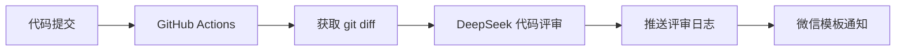

# OpenAI Code Review

基于 GitHub Actions 和 DeepSeek 的自动代码评审工具。项目提交代码后，工具会读取最近一次提交的 `git diff`，调用 DeepSeek 生成评审意见，将结果推送到独立的日志仓库，并通过微信公众号模板消息发送通知。

## 功能

- 自动获取最近一次提交的代码差异
- 使用 DeepSeek `deepseek-chat` 模型完成代码评审
- 将 Markdown 格式的评审结果提交到 GitHub 日志仓库
- 通过微信公众号测试号或公众号发送模板消息
- 支持以可执行 JAR 的方式接入其他 GitHub 项目

## 工作流程



核心代码按照领域服务和基础设施进行拆分：

```text
openai-code-review-sdk
├── domain/service          评审流程编排
├── infrastructure/git     Git 差异读取与日志推送
├── infrastructure/openai  DeepSeek API 适配
├── infrastructure/weixin  微信模板消息适配
└── types/utils             通用工具
```

## 快速接入

使用者不需要复制本项目源码。只需在自己的项目中添加 GitHub Actions workflow，并在运行时下载可执行 JAR。

在目标项目中新建 `.github/workflows/code-review.yml`：

```yaml
name: AI Code Review

on:
  push:
    branches:
      - main
  pull_request:
    branches:
      - main

jobs:
  review:
    runs-on: ubuntu-latest

    steps:
      - name: Checkout repository
        uses: actions/checkout@v4
        with:
          fetch-depth: 2

      - name: Set up Java
        uses: actions/setup-java@v4
        with:
          distribution: temurin
          java-version: "11"

      - name: Download OpenAI Code Review
        run: |
          mkdir -p ./libs
          curl -fL \
            -o ./libs/openai-code-review-sdk-1.0.jar \
            https://github.com/yan369-ivy/openai-code-review-log/releases/download/v1.0/openai-code-review-sdk-1.0.jar

      - name: Read commit information
        run: |
          echo "COMMIT_PROJECT=${GITHUB_REPOSITORY##*/}" >> "$GITHUB_ENV"
          echo "COMMIT_BRANCH=${GITHUB_HEAD_REF:-${GITHUB_REF#refs/heads/}}" >> "$GITHUB_ENV"
          echo "COMMIT_AUTHOR=$(git log -1 --pretty=format:'%an <%ae>')" >> "$GITHUB_ENV"
          echo "COMMIT_MESSAGE=$(git log -1 --pretty=format:'%s')" >> "$GITHUB_ENV"

      - name: Run code review
        run: java -jar ./libs/openai-code-review-sdk-1.0.jar
        env:
          GITHUB_REVIEW_LOG_URI: ${{ secrets.CODE_REVIEW_LOG_URI }}
          GITHUB_TOKEN: ${{ secrets.CODE_TOKEN }}
          COMMIT_PROJECT: ${{ env.COMMIT_PROJECT }}
          COMMIT_BRANCH: ${{ env.COMMIT_BRANCH }}
          COMMIT_AUTHOR: ${{ env.COMMIT_AUTHOR }}
          COMMIT_MESSAGE: ${{ env.COMMIT_MESSAGE }}
          WEIXIN_APPID: ${{ secrets.WEIXIN_APPID }}
          WEIXIN_SECRET: ${{ secrets.WEIXIN_SECRET }}
          WEIXIN_TOUSER: ${{ secrets.WEIXIN_TOUSER }}
          WEIXIN_TEMPLATE_ID: ${{ secrets.WEIXIN_TEMPLATE_ID }}
          DEEPSEEK_API_HOST: ${{ secrets.DEEPSEEK_API_HOST }}
          DEEPSEEK_API_KEY: ${{ secrets.DEEPSEEK_API_KEY }}
```

如果目标项目的默认分支不是 `main`，请修改 workflow 中的分支名称。

## Secrets 配置

进入目标项目的：

```text
Settings -> Secrets and variables -> Actions -> New repository secret
```

添加以下 Repository Secrets：

| Secret | 说明 | 示例 |
| --- | --- | --- |
| `CODE_REVIEW_LOG_URI` | 存放评审结果的 GitHub 仓库地址，不需要以 `.git` 结尾 | `https://github.com/user/code-review-log` |
| `CODE_TOKEN` | 对日志仓库具有写权限的 GitHub Personal Access Token | `github_pat_...` |
| `DEEPSEEK_API_HOST` | DeepSeek Chat Completions 完整地址 | `https://api.deepseek.com/chat/completions` |
| `DEEPSEEK_API_KEY` | DeepSeek API Key | `sk-...` |
| `WEIXIN_APPID` | 微信公众号或测试号 AppID | 由微信平台提供 |
| `WEIXIN_SECRET` | 微信公众号或测试号 AppSecret | 由微信平台提供 |
| `WEIXIN_TOUSER` | 接收模板消息的用户 OpenID | 由微信平台提供 |
| `WEIXIN_TEMPLATE_ID` | 微信模板消息 ID | 由微信平台提供 |

不要将 Token、API Key 或微信密钥直接写入源码或 workflow。

## 微信模板

当前程序会向模板传递以下字段：

| 字段 | 内容 |
| --- | --- |
| `repo_name` | 项目名称 |
| `branch_name` | 提交分支 |
| `commit_author` | 提交作者 |
| `commit_message` | 提交信息 |

模板内容可以参考：

```text
项目：{{repo_name.DATA}}
分支：{{branch_name.DATA}}
作者：{{commit_author.DATA}}
说明：{{commit_message.DATA}}
```

模板消息的跳转链接为本次生成的评审日志地址。

## 从源码构建

环境要求：

- JDK 8 或更高版本
- Maven 3.6 或更高版本

执行：

```bash
mvn clean package
```

构建完成后，可执行 JAR 位于：

```text
openai-code-review-sdk/target/openai-code-review-sdk-1.0.jar
```

本地运行前需要设置与 GitHub Actions 相同的环境变量：

```bash
java -jar openai-code-review-sdk/target/openai-code-review-sdk-1.0.jar
```

## 注意事项

- `actions/checkout` 必须设置 `fetch-depth: 2`，否则无法比较最近两次提交。
- 日志仓库需要提前创建，`CODE_TOKEN` 必须拥有该仓库的写权限。
- Pull Request 来自 fork 时，GitHub 默认不会向 workflow 提供 Repository Secrets。
- 程序会将评审结果写入日志仓库的日期目录中。
- 每次发布新版本后，应同步修改 workflow 中的 Release 标签和 JAR 文件名。

## 常见问题

### Required environment variable is missing

说明对应的 GitHub Secret 没有注入。请检查 Secret 名称是否与 workflow 完全一致，并确认它配置在当前运行 workflow 的仓库中。

### 无法获取 git diff

确认 checkout 使用了：

```yaml
with:
  fetch-depth: 2
```

### 无法推送评审日志

检查 `CODE_REVIEW_LOG_URI` 是否为正确的仓库地址，以及 `CODE_TOKEN` 是否具有 Contents 写权限。

## License

本项目仅用于学习和技术交流。
